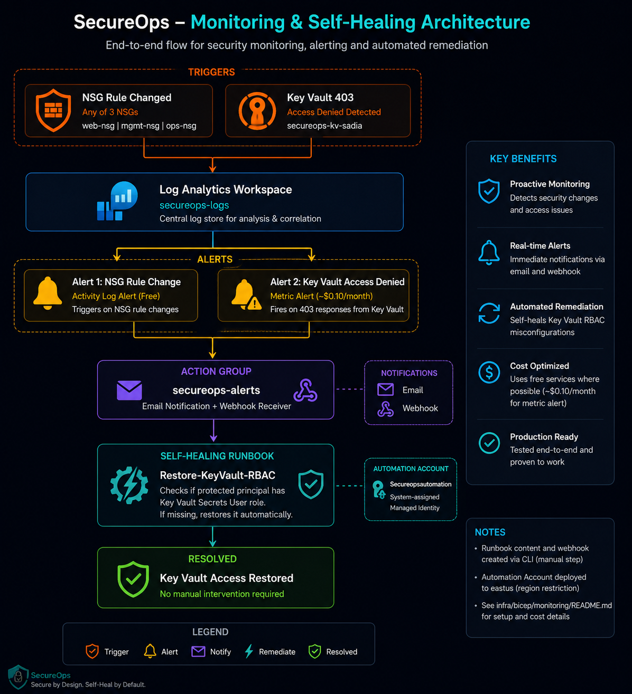

# SecureOps Phase 2 - Monitoring and Self-Healing (Bicep)

Deploys Log Analytics Workspace, NSG and Key Vault diagnostic settings,
an Action Group, two alert rules, and an Automation Account with a
self-healing runbook that restores Key Vault RBAC access automatically.

Note: the runbook PowerShell content and webhook URL must be published
manually after the Bicep deployment, since Bicep cannot publish inline
runbook content without a public content link. See the commands below.

Publish the runbook content:
az automation runbook replace-content --resource-group secureops-rg --automation-account-name Secureopsautomation --name Restore-KeyVault-RBAC --content @automation/runbooks/restore-keyvault-rbac-runbook.ps1

Publish the runbook:
az automation runbook publish --resource-group secureops-rg --automation-account-name Secureopsautomation --name Restore-KeyVault-RBAC

Cost summary: Log Analytics, NSG diagnostics, Key Vault diagnostics, and
the nsg-rule-change-alert are all free. keyvault-access-denied costs
about 0.10 USD per month. Automation Account is on the free tier.

## Architecture

## What this deploys

- Log Analytics Workspace (secureops-logs) as the central log store
- Diagnostic settings routing logs from all 3 NSGs (web-nsg, mgmt-nsg, ops-nsg) and Key Vault (secureops-kv-sadia) into the workspace
- Action Group (secureops-alerts) with email notification and a webhook receiver
- Alert 1, nsg-rule-change-alert: fires on NSG rule changes (Activity Log alert, free)
- Alert 2, keyvault-access-denied: fires on 403 responses from Key Vault (metric alert, about 0.10 USD per month)
- Automation Account (Secureopsautomation) with a system-assigned managed identity
- Self-healing runbook (Restore-KeyVault-RBAC): checks whether a protected principal still has the Key Vault Secrets User role, and restores it automatically if missing. Tested and confirmed working end to end.

## Why this design

The original plan assumed a VM and AKS cluster as the self-healing target. Neither exists in this resource group, only ACR, Key Vault, VNet, and NSGs. Rather than provisioning new compute just to have something to break, this addresses a real failure mode already hit during Phase 1, Key Vault RBAC misconfiguration breaking pipeline access. The runbook was tested directly and confirmed working, detecting a missing role assignment and restoring it without manual intervention.
